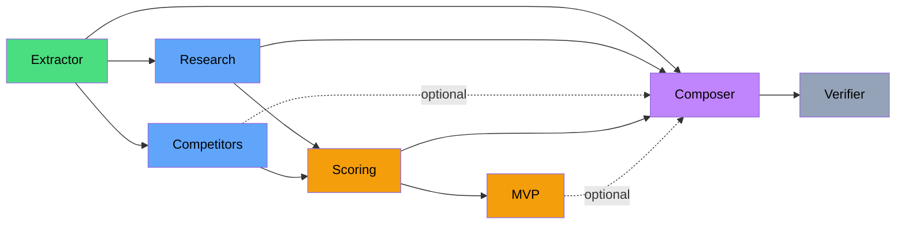
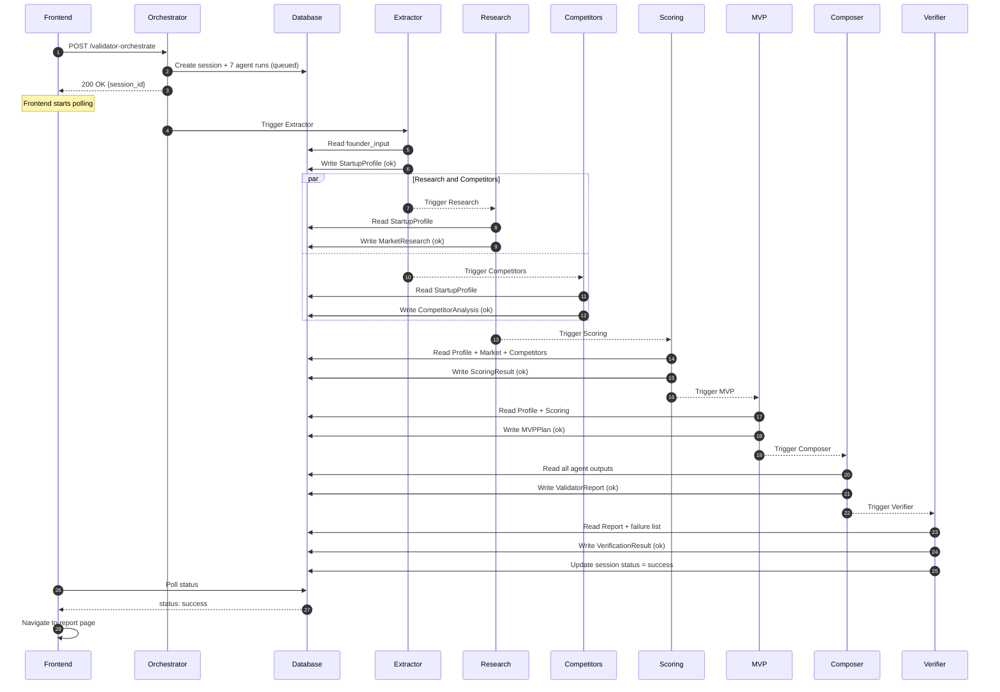
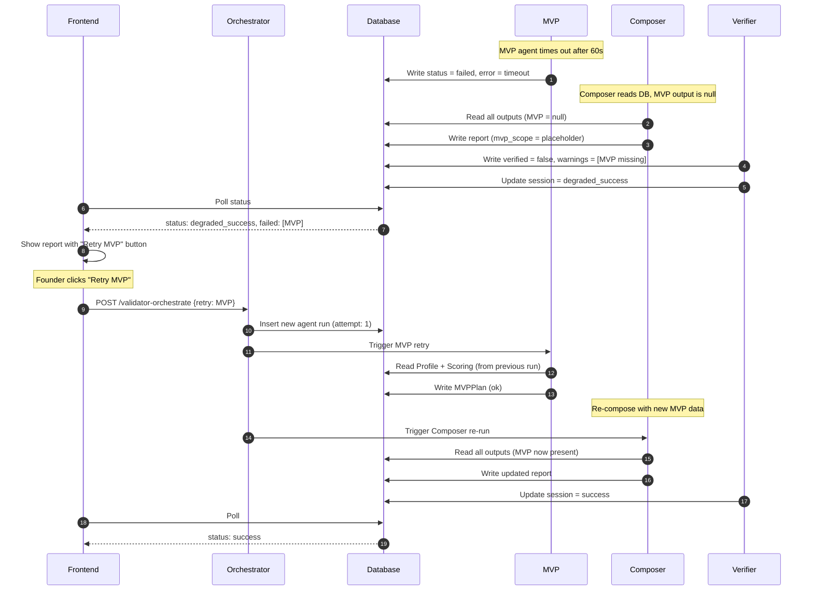
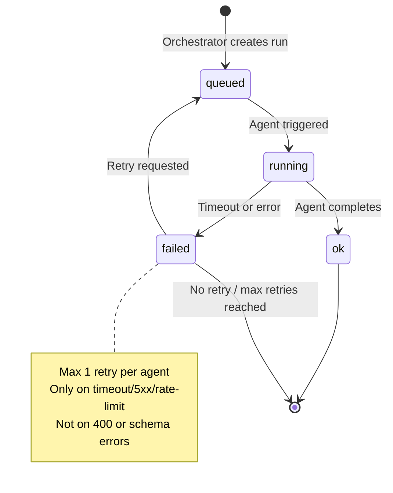
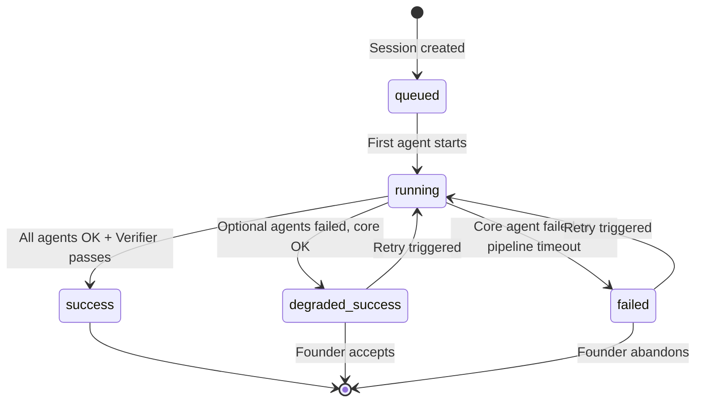
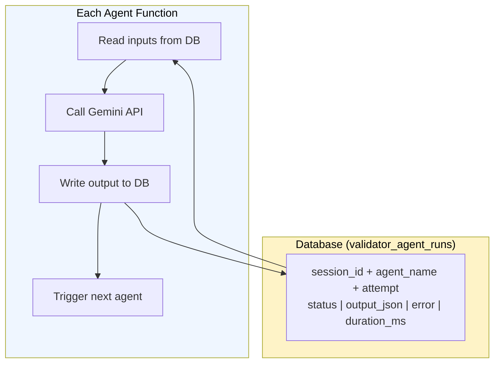

# Validator v2 — Agent Workflows

> AI agent orchestration, DAG execution, failure handling, and inter-agent communication.

---

## Agent Dependency Graph

The pipeline is a directed acyclic graph. Research and Competitors run in parallel after Extractor. Scoring waits for Research + Competitors. MVP needs Scoring. Composer assembles everything. Verifier checks the final output.

**Legend:** Green = extraction, Blue = research, Amber = analysis, Purple = composition, Grey = validation. Dashed lines = optional inputs.

---

## Happy Path Sequence

All 7 agents succeed. Orchestrator dispatches, agents read inputs from DB, write outputs to DB.

---

## Failure and Retry Sequence

MVP times out. Composer runs without MVP data. Founder retries MVP later.

---

## Agent State Machine

Each agent follows the same lifecycle. The orchestrator manages transitions.

---

## Session State Machine

The session aggregates agent states into a single founder-facing status.

**Core agents** (failure = `failed`): Extractor, Research, Scoring, Composer
**Optional agents** (failure = `degraded_success`): Competitors, MVP

---

## Inter-Agent Communication Pattern

Agents never share in-memory state. All communication flows through the database.

---

## Dispatch Pattern Options

How does one agent trigger the next? Three options evaluated.

```mermaid
flowchart TD
    subgraph A["Option A: DB Polling"]
        A1[Agent writes output] --> A2[Orchestrator polls DB every 2s]
        A2 --> A3[Sees dependency met] --> A4[Triggers next agent]
    end

    subgraph B["Option B: Direct Invoke"]
        B1[Agent finishes] --> B2[Agent calls next Edge Function via fetch]
        B2 --> B3[Next agent starts]
    end

    subgraph C["Option C: DB Trigger + Webhook"]
        C1[Agent writes output] --> C2[Postgres trigger fires]
        C2 --> C3[pg_net calls next Edge Function]
        C3 --> C4[Next agent starts]
    end

    style A fill:#fef3c7,color:#000
    style B fill:#dcfce7,color:#000
    style C fill:#fce7f3,color:#000
```

| Option | Latency | Complexity | Reliability |
|--------|---------|------------|-------------|
| A: DB Polling | 2-5s per hop | Low | High |
| B: Direct Invoke | Instant | Medium | Medium (agent must know next) |
| C: DB Trigger | ~1s | High | High (but pg_net limits) |

**Recommendation:** Start with Option B (direct invoke) for simplicity. Each agent knows its successor and calls it via `fetch()` before exiting. Fall back to Option A if direct invoke proves fragile.

---

## Timeout Budget Allocation

Each agent has an independent timeout. No shared pipeline deadline.

```mermaid
gantt
    title Agent Timeout Budgets (Independent)
    dateFormat s
    axisFormat %Ss

    section Critical Path
    Extractor (20s max)     :ext, 0, 20s
    Research (90s max)      :res, 0, 90s
    Scoring (45s max)       :score, 0, 45s
    Composer (120s max)     :comp, 0, 120s
    Verifier (5s max)       :ver, 0, 5s

    section Background
    Competitors (120s max)  :crit, competitors, 0, 120s

    section Optional
    MVP (60s max)           :mvp, 0, 60s
```

**Key difference from v1:** No shared 115s deadline. Each agent manages its own timeout. Deno Deploy's 150s limit applies per-function, not to the whole pipeline.
