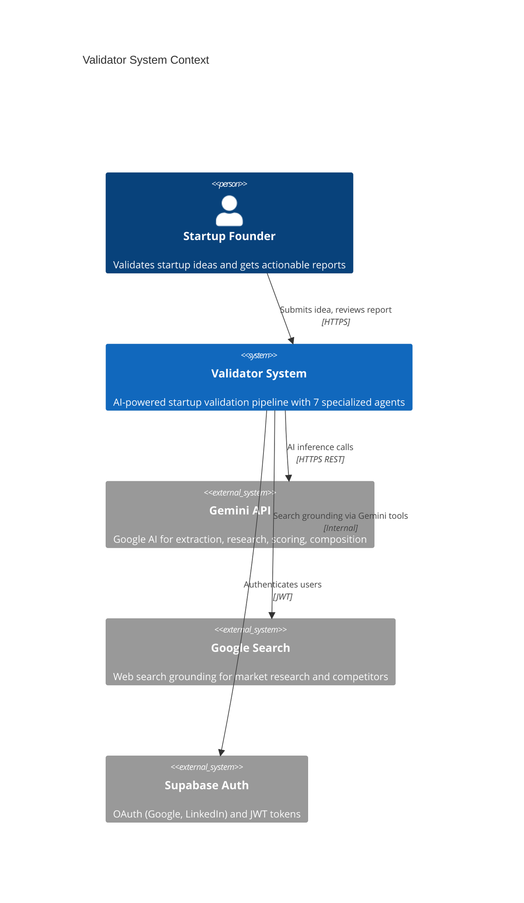
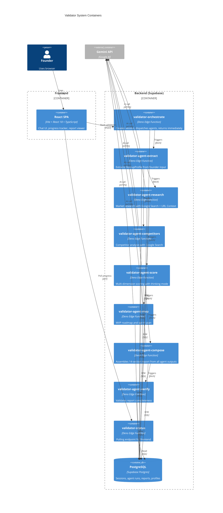
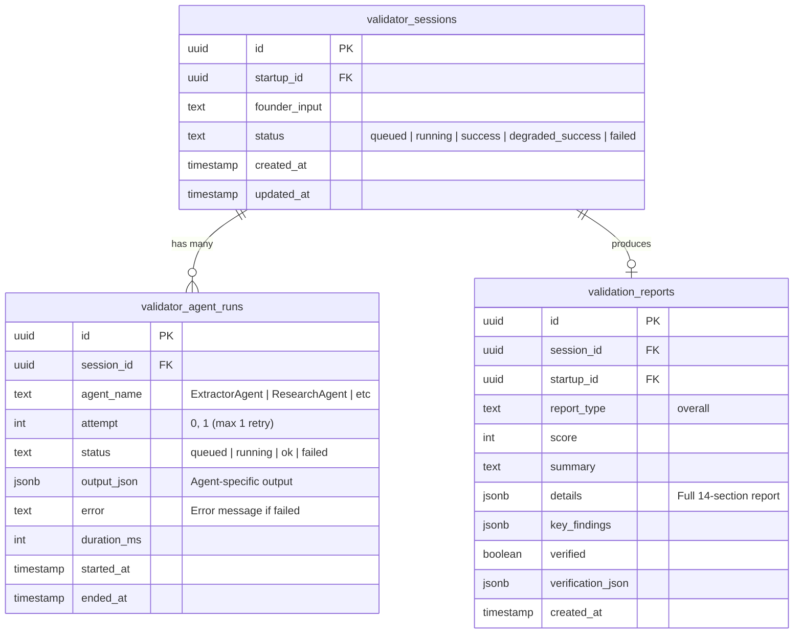
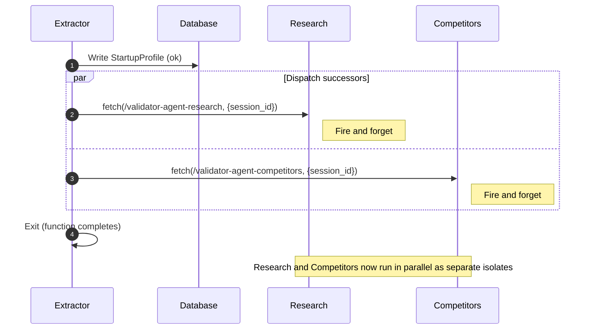
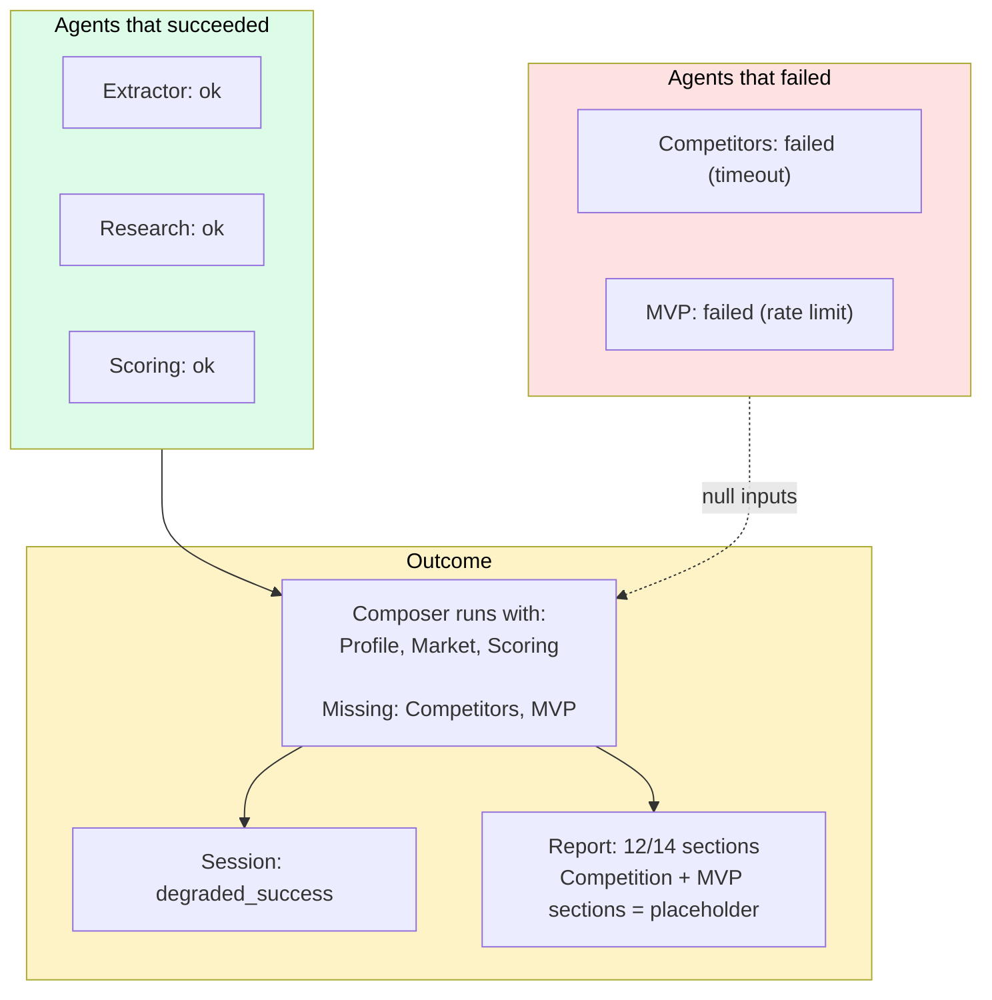
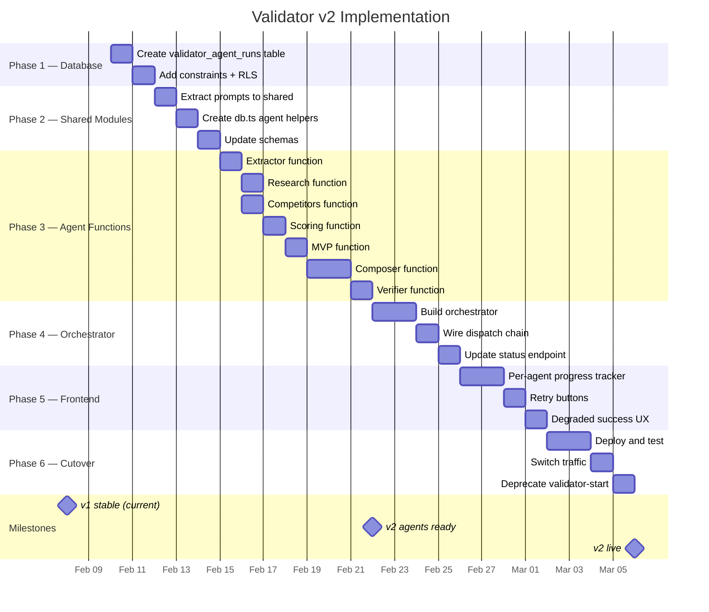

# Validator v2 — Edge Function Architecture

> System architecture, container design, database schema, and implementation roadmap.

---

## System Context (C4 Level 1)

Who interacts with the Validator system and what external services does it depend on.



---

## Container Diagram (C4 Level 2)

The Validator system broken into deployable containers.



---

## Database Schema

Two tables replace the current monolith approach.



**Key improvement:** `validator_agent_runs` tracks each agent independently with attempt numbers. Unique constraint on `(session_id, agent_name, attempt)` prevents duplicates and enables clean retries.

---

## Shared Module Structure

All agents share common utilities to avoid duplication.

```mermaid
flowchart TD
    subgraph Shared["_shared/"]
        GEM[gemini.ts<br/>Gemini API client + JSON extraction]
        DB[db.ts<br/>Agent run CRUD helpers]
        TYPES[types.ts<br/>Shared TypeScript types]
        SCHEMAS[schemas.ts<br/>JSON schemas for each agent]
        CORS[cors.ts<br/>CORS headers]
        subgraph Prompts["prompts/"]
            P1[extract.ts]
            P2[research.ts]
            P3[competitors.ts]
            P4[score.ts]
            P5[mvp.ts]
            P6[compose.ts]
        end
    end

    subgraph Functions["Edge Functions"]
        F0[validator-orchestrate]
        F1[validator-agent-extract]
        F2[validator-agent-research]
        F3[validator-agent-competitors]
        F4[validator-agent-score]
        F5[validator-agent-mvp]
        F6[validator-agent-compose]
        F7[validator-agent-verify]
        F8[validator-status]
    end

    F0 --> DB
    F0 --> TYPES
    F1 --> GEM
    F1 --> DB
    F1 --> SCHEMAS
    F1 --> P1
    F2 --> GEM
    F2 --> DB
    F2 --> SCHEMAS
    F2 --> P2
    F3 --> GEM
    F3 --> DB
    F3 --> P3
    F4 --> GEM
    F4 --> DB
    F4 --> SCHEMAS
    F4 --> P4
    F5 --> GEM
    F5 --> DB
    F5 --> P5
    F6 --> GEM
    F6 --> DB
    F6 --> SCHEMAS
    F6 --> P6
    F7 --> DB
    F7 --> TYPES
    F8 --> DB
    F8 --> CORS

    style Shared fill:#fef3c7,color:#000
    style Prompts fill:#fde68a,color:#000
    style Functions fill:#dbeafe,color:#000
```



---

## Request Flow (Orchestrator Detail)

What happens inside the orchestrator when a validation is triggered.

```mermaid
flowchart TD
    REQ[POST /validator-orchestrate] --> AUTH{JWT valid?}
    AUTH -->|No| REJECT[401 Unauthorized]
    AUTH -->|Yes| PARSE[Parse founder_input]

    PARSE --> SESSION[Insert validator_session<br/>status: queued]
    SESSION --> RUNS["Insert 7 agent_runs<br/>all status: queued"]
    RUNS --> RESPOND[Return 200 {session_id}]

    RESPOND --> TRIGGER[Fire-and-forget:<br/>fetch validator-agent-extract]

    TRIGGER --> DONE[Orchestrator exits]

    style REQ fill:#60a5fa,color:#000
    style RESPOND fill:#4ade80,color:#000
    style TRIGGER fill:#f59e0b,color:#000
    style DONE fill:#94a3b8,color:#000
```

**Critical rule:** Orchestrator returns immediately. It does NOT wait for any agent. This keeps response time under 2 seconds.

---

## Agent Chain Dispatch

How agents chain to each other. Each agent triggers its successor(s) before exiting.



**Each agent is responsible for:**
1. Reading its inputs from DB
2. Calling Gemini
3. Writing its output to DB
4. Triggering the next agent(s)
5. Exiting

---

## Failure Isolation

When one agent fails, the damage is contained.



---

## Migration Strategy: v1 to v2

How to move from the current monolith pipeline to per-agent functions without downtime.

```mermaid
flowchart LR
    subgraph Phase1["Phase 1: Database"]
        P1A[Create validator_agent_runs table]
        P1B[Add unique constraint]
        P1C[Add RLS policies]
        P1A --> P1B --> P1C
    end

    subgraph Phase2["Phase 2: Shared Modules"]
        P2A[Extract prompts to _shared/prompts/]
        P2B[Create db.ts agent helpers]
        P2C[Update schemas.ts]
        P2A --> P2B --> P2C
    end

    subgraph Phase3["Phase 3: Agent Functions"]
        P3A[Create validator-agent-extract]
        P3B[Create validator-agent-research]
        P3C[Create validator-agent-competitors]
        P3D[Create validator-agent-score]
        P3E[Create validator-agent-mvp]
        P3F[Create validator-agent-compose]
        P3G[Create validator-agent-verify]
    end

    subgraph Phase4["Phase 4: Orchestrator"]
        P4A[Create validator-orchestrate]
        P4B[Wire dispatch chain]
        P4C[Update validator-status for new schema]
    end

    subgraph Phase5["Phase 5: Frontend"]
        P5A[Update progress tracker for per-agent status]
        P5B[Add retry buttons per agent]
        P5C[Update report page for degraded_success]
    end

    subgraph Phase6["Phase 6: Cutover"]
        P6A[Deploy all new functions]
        P6B[Switch frontend to validator-orchestrate]
        P6C[Deprecate validator-start]
    end

    Phase1 --> Phase2 --> Phase3 --> Phase4 --> Phase5 --> Phase6

    style Phase1 fill:#fef3c7,color:#000
    style Phase2 fill:#fde68a,color:#000
    style Phase3 fill:#dbeafe,color:#000
    style Phase4 fill:#c7d2fe,color:#000
    style Phase5 fill:#dcfce7,color:#000
    style Phase6 fill:#fce7f3,color:#000
```



---

## Implementation Timeline



---

## Risk Matrix

| Risk | Impact | Likelihood | Mitigation |
|------|--------|------------|------------|
| Inter-agent dispatch fails silently | High | Medium | Agent writes "triggered_next" to DB; status endpoint detects stuck agents |
| Deno Deploy cold starts add latency | Medium | High | Accept 2-3s cold start per agent; pre-warm with health checks |
| Retry creates duplicate agent runs | High | Low | Unique constraint on (session_id, agent_name, attempt) |
| Migration breaks existing sessions | High | Low | Keep v1 running until v2 is stable; no shared DB tables |
| 8 function deployments are slow | Low | Medium | CI/CD deploys in parallel; shared modules reduce per-function code |

---

## Decision Log

| Decision | Chosen | Rejected | Rationale |
|----------|--------|----------|-----------|
| Agent communication | DB relay | Shared memory, message queue | Supabase DB is already available, no new infra |
| Dispatch pattern | Direct invoke (fetch) | DB polling, Postgres triggers | Lowest latency, simplest to implement |
| Retry strategy | Max 1 retry, timeout/5xx only | Unlimited retries, retry all errors | Prevents cost explosion, schema errors need prompt fixes not retries |
| Composer input handling | Accept null optional inputs | Fail if any input missing | Enables degraded_success, founder always gets partial value |
| Session status model | 5 states (queued, running, success, degraded_success, failed) | 3 states (pending, complete, failed) | degraded_success is critical for founder UX |
